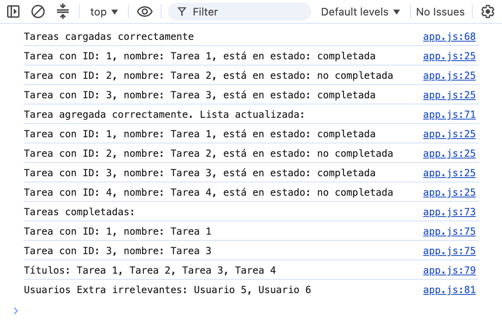

# Gestor de tareas — Clases, asincronía y métodos de array

Proyecto de la **Unidad 3 del módulo "JavaScript avanzado"**. Es un gestor de tareas que define clases con propiedades y métodos, simula la carga inicial de datos de forma asíncrona con `Promise` y `setTimeout`, y manipula la lista de tareas con los métodos de array `forEach`, `find`, `filter` y `map`. Toda la salida se muestra por la consola del navegador.

## Tecnologías

- HTML5
- JavaScript (clases, `async`/`await`, `Promise`, `Promise.all`, métodos de array)

## Cómo funciona

1. La clase `Tarea` define cada tarea con `id`, `titulo` y `completada` (validada como booleano), más un método `toggleEstado()` que invierte su estado.
2. La clase `GestorTareas` contiene el array de tareas y los métodos para agregar (`agregarTarea`), listar (`listarTareas` con `forEach`), buscar (`buscarPorTitulo` con `find`) y filtrar las completadas (`listarCompletadas` con `filter`).
3. La función `cargarTareas()` devuelve una `Promise` que, mediante `setTimeout`, simula una carga de 2 segundos y resuelve con un array de 3 tareas iniciales.
4. La función `main()` usa `async`/`await` para esperar la carga, asignar las tareas al gestor y ejecutar el flujo: listar, agregar una tarea, volver a listar y filtrar las completadas.
5. Como extra, se usa `map` para obtener un array con los títulos y `Promise.all` para cargar tareas y usuarios en paralelo.

## Cómo clonar y ejecutar

No requiere dependencias ni instalación. Basta con abrir el `index.html` en el navegador.

```bash
git clone https://github.com/TU-USUARIO/gestor-de-tareas.git
cd gestor-de-tareas
```

Luego abrí `index.html` con doble clic, o serví la carpeta con cualquier servidor estático (por ejemplo `Live Server` en VS Code). La salida del programa se ve en la **consola del navegador** (F12 → pestaña *Console*).

## Estructura

```
.
├── index.html      # Carga el script principal
├── script.js       # Clases Tarea y GestorTareas, carga asíncrona y flujo del programa
└── README.md
```

## Captura

**Salida del programa en consola**



## Créditos

- **Autora:** Candela Corradin
- **Curso:** JavaScript avanzado
- **Unidad:** Módulo 1 — Unidad 3
